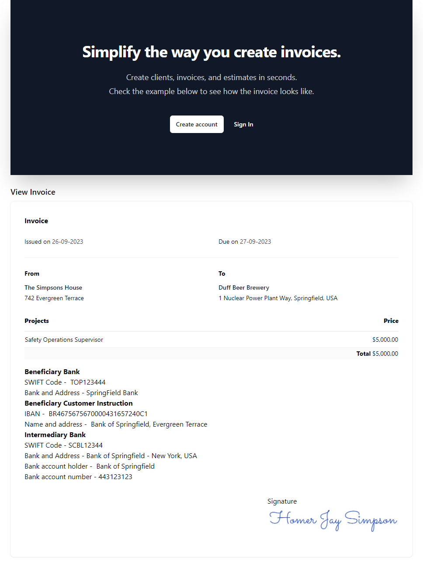

# Invoice Rocket

This repository provides a solution to generate invoices using only FE technologies.

**Live Demo**

https://invoice-rocket-hovuk6vy7-frontandrews.vercel.app/

**How to install**

`yarn install`

`yarn dev`

**How to generate an invoice**

- Create an account
  - It will redirect you automatically to the dashboard page
- Create one or more clients
- Fill your profile by clicking on the top right menu button
  - This you automatically fill the invoice with your data
- Create an invoice adding items to it.
  - Click to see the invoice

**Basic Features**
- Authentication using Firebase.
- Hooks
- Redux
- High Order Components

**Bonus features**
- Custom Notification Toast
- export PDF
- export JPG
- Protected Routes
- Rich Text Editor

### Stack

- React
- NextJS
- Redux
- Typescript
- Javascript

### Possible Improvements

- Integrate an API for the backend - to replace the current localStorage setup.
- Enhance protected guards
- Improve Home page.

### Design Choices

- State Management
  - Using Redux for application state and ContextAPI specifically for notification toasts.
- Routing
  - next/navigation
- Data Fetching
  - Currently, there are no API calls; all data are managed through Redux and saved in localStorage.
- Styling
  - Using mainly tailwind classes with some small css
- Performance
  - Some components use client features, to prevent SSR issues they are been imported dynamically.
- Error Handling
  - I focused mainly in the login and create account
- Testing
  - Unfortunatly I didn't had time to write more tests, but I'm using typescript
- Code Quality
  - Eslint
- User Experience
  - I created tailored to my own needs, based on past invoices I have sent to companies, so I didn't include some features such as hours, or time, as they are not important to my use case.

### Pitfalls

- I decided to use the new `next 13` application directory feature, but I faced more errors than I expected, which motivated me to keep learning more about these features, the projects I worked on with Next didn't use this feature yet.